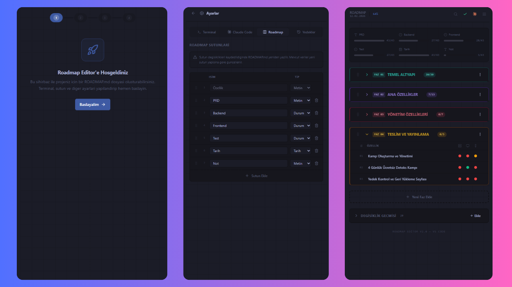

<p align="center">
  
</p>

<h1 align="center">Kairos</h1>

<p align="center">
  <strong>Proje gelistirme kokpiti</strong> — PRD, roadmap, Git ve AI araclari tek arayuzden.<br>
  Dosyalarla ve terminalle ugrasma, projenizi gorsel arayuzden yonetin.
</p>

<p align="center">
  <a href="https://code.visualstudio.com/"></a>
  <a href="https://github.com/Kenfrozz/kairos-vscode/releases"></a>
  <a href="LICENSE"></a>
</p>

<p align="center">
  
</p>

---

## Ozellikler

| Ozellik | Aciklama |
|---------|----------|
| **Gorsel Editor** | Tab veya sidebar panelinde KAIROS.md dosyanizi gorsel olarak yonetin |
| **Surekle & Birak** | Satir ve fazlari surukleyerek kolayca siralama |
| **Faz Yonetimi** | Projenizi fazlara bolun, isimlendirin ve renklendirin |
| **Durum Takibi** | Her oge icin durum belirleyin (Tamamlandi, Devam Ediyor, Yapilmadi, N/A) |
| **Dinamik Sutunlar** | `text`, `status`, `date` tiplerinde ozel sutun tanimlama |
| **Tarih Secici** | Takvim bileseninden tarih atama |
| **Changelog** | Degisiklik gecmisini yonetin |
| **PRD Entegrasyonu** | PRD.md dosyasini satir bazli goruntuleme ve duzenleme |
| **Terminal Entegrasyonu** | Komutlari dogrudan VS Code terminalinde calistirin |
| **Backup & Restore** | Otomatik yedekleme ve geri yukleme |
| **Git Entegrasyonu** | Branch durumu, commit, push, pull islemlerini arayuzden yonetin |
| **Tema Uyumu** | VS Code temanizla otomatik renk senkronizasyonu |
| **Claude AI** | Ozellik bazli Claude komutu calistirma |

## Kurulum

### Marketplace'den (yakin zamanda)

VS Code Extensions bolumunden **Kairos** aratarak yukleyin.

### Manuel Kurulum

```bash
git clone https://github.com/Kenfrozz/kairos-vscode.git
cd kairos-vscode
npm install
npm run build
```

Olusturulan `.vsix` dosyasini VS Code'a yukleyin:

```bash
npm run package
code --install-extension kairos-*.vsix
```

## Kullanim

### Kairos'u Acma

1. **Komut Paleti** (`Ctrl+Shift+P`) > `Kairos: Open (Tab)`
2. Veya sol kenar cubugundaki **Kairos** ikonuna tiklayin

### Yeni Roadmap Olusturma

Workspace'inizde bir `KAIROS.md` dosyasi yoksa, editor otomatik olarak yeni bir tane olusturmanizi onerir. Ilk acilista sutun yapilandirmanizi da yapabilirsiniz.

### Durum Ikonlari

| Ikon | Anlam |
|------|-------|
| ✅ | Tamamlandi |
| ⚠️ | Devam Ediyor |
| ❌ | Yapilmadi |
| - | N/A |

## Varsayilan Fazlar

| # | Faz | Aciklama |
|---|-----|----------|
| 1 | **Planlama & Altyapi** | Proje kurulumu ve temel yapilandirma |
| 2 | **Cekirdek Gelistirme** | Ana ozelliklerin gelistirilmesi |
| 3 | **Ileri Ozellikler** | Gelismis ozellik ve entegrasyonlar |
| 4 | **Test & Yayin** | Test, optimizasyon ve dagitim |

Faz sayisi ve isimleri tamamen ozellestirilebilir.

## Varsayilan Sutunlar

| Sutun | Tip | Aciklama |
|-------|-----|----------|
| Ozellik | `text` | Is kaleminin adi |
| PRD | `text` | Ilgili PRD referansi |
| Backend | `status` | Backend gelistirme durumu |
| Frontend | `status` | Frontend gelistirme durumu |
| Test | `status` | Test durumu |
| Tarih | `date` | Hedef / tamamlanma tarihi |
| Not | `text` | Ek aciklama |

## Ayarlar

Workspace kokunde `.kairos-settings.json` dosyasi ile kisisellestirebilirsiniz:

```jsonc
{
  "version": 1,
  "terminal": {
    "defaultTerminalId": "pwsh",
    "availableTerminals": []
  },
  "claude": {
    "mainCommand": "claude --dangerously-skip-permissions",
    "featureCommand": "claude \"${ozellik}\""
  },
  "roadmap": {
    "columns": [
      { "key": "ozellik", "label": "Ozellik", "type": "text" },
      { "key": "backend", "label": "Backend", "type": "status" },
      { "key": "frontend", "label": "Frontend", "type": "status" },
      { "key": "tarih", "label": "Tarih", "type": "date" }
    ]
  }
}
```

### Sutun Tipleri

- **`text`** — Serbest metin girisi
- **`status`** — Durum secici (Tamamlandi / Devam Ediyor / Yapilmadi / N/A)
- **`date`** — Takvim ile tarih secimi

## Gelistirme

```bash
# Bagimliliklari yukle
npm install

# Watch modunda gelistirme
npm run watch

# Uretim build
npm run build

# VSIX paketi olustur
npm run package
```

### Proje Yapisi

```
kairos-vscode/
├── src/                           # Extension backend (TypeScript)
│   ├── extension.ts               # Activation & komut kayitlari
│   ├── KairosPanel.ts             # Tab webview paneli
│   ├── KairosSidebarProvider.ts   # Sidebar webview
│   ├── api/index.ts               # Mesaj router
│   ├── types.ts                   # Tip tanimlari
│   └── backend/                   # Is mantigi modulleri
│       ├── _core/db.ts            # Dosya I/O wrapper
│       ├── plan/                  # KAIROS.md CRUD islemleri
│       ├── yedek/                 # Yedekleme & geri yukleme
│       ├── prd/                   # PRD.md islemleri
│       ├── ayarlar/               # Ayarlar yonetimi
│       ├── terminal/              # Terminal entegrasyonu
│       └── git/                   # Git islemleri (durum, commit, push, pull)
├── webview/                       # React frontend (JSX)
│   ├── App.jsx                    # Ana uygulama bileseni
│   ├── main.jsx                   # React entry point
│   ├── vscodeApi.js               # VS Code API koprusu
│   ├── index.css                  # Tailwind CSS & tema
│   ├── components/                # UI bilesenleri
│   │   ├── ui/                    # shadcn/ui primitifleri
│   │   ├── GitPanel.jsx           # Git panel & durum badge
│   │   ├── FazTable.jsx           # Faz tablosu (DnD, collapse)
│   │   ├── SortableRow.jsx        # Suruklenebilir satirlar
│   │   └── ...                    # Diger bilesenler
│   ├── pages/                     # Tam sayfa gorunumler
│   │   ├── SettingsView.jsx       # Ayarlar sayfasi
│   │   └── SetupWizard.jsx        # Ilk kurulum sihirbazi
│   └── lib/                       # Yardimci fonksiyonlar
├── media/                         # Ikon dosyalari
├── esbuild.mjs                    # Build yapilandirmasi
├── tailwind.config.js             # Tailwind yapilandirmasi
└── package.json                   # Extension manifest
```

## Mimari

Kairos, **3-Katmanli Lokal-First Mimari** kullanir. Frontend, backend'den tamamen izole calisir:

```
webview/ (React)  →  postMessage  →  src/api/ (Router)  →  src/backend/ (Is Mantigi)
```

- Frontend asla backend modullerini import etmez
- Tum iletisim `postMessage` tabanlı API katmani uzerinden yapilir
- Her backend dosyasi tek bir `execute()` fonksiyonu icerir
- Dosya sistemine erisim `_core/db.ts` uzerinden yapilir

Detaylar icin [ARCHITECTURE.md](ARCHITECTURE.md) dosyasina bakin.

## Gereksinimler

- VS Code **1.85.0** veya uzeri

## Sorun Bildirme & Katkida Bulunma

Bir hata buldunuz veya yeni bir ozellik istiyorsunuz? [GitHub Issues](https://github.com/Kenfrozz/kairos-vscode/issues) uzerinden bildirebilirsiniz.

Katkida bulunmak icin:

1. Repo'yu fork edin
2. Yeni bir branch olusturun (`git checkout -b feature/yeni-ozellik`)
3. Degisikliklerinizi commit edin
4. Pull request gonderin

## Lisans

[MIT](LICENSE)
